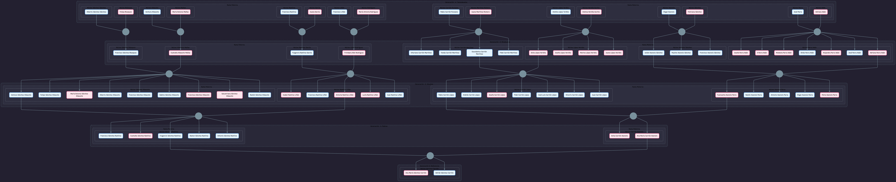
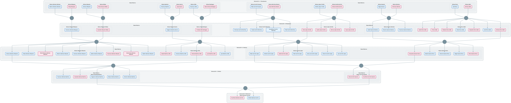

<p align="center">
  
</p>

<div align="center">
  <h1><span style="color: rgb(210, 201, 40);">Interactive Family Tree Template using Mermaid</span></h1>

  <hr style="border:none; height:0.3px; background-color:#777; width:65%; margin:30px auto 35px auto;">

  <p>
    <a href="https://mermaid.js.org/"></a>
    <a href="https://git-scm.com/"></a>
    <a href="https://github.com/"></a>
    <a href="https://www.markdownguide.org/"></a>
  </p>

  <p>
    <a href="#-description">Description</a> •
    <a href="#-repository-structure">Structure</a> • 
    <a href="#️-requirements">Requirements</a> • 
    <a href="#-installation">Installation</a> • 
    <a href="#-usage">Usage</a> • 
    <a href="#-demonstration">Demonstration</a> • 
    <a href="#-notes">Notes</a> • 
    <a href="#-contacto">Contacto</a>
  </p>
</div>


<br>

---

## 📄 Description

A scalable and clean template to build an interactive family tree using **Mermaid.js**. It features a highly organized structure, utilizing nested subgraphs to clearly group individuals by generation, maternal/paternal branches, and unique family nuclei based on shared last names.

> [!WARNING]
> **Personal Data Notice:** The data provided in the template files belongs to my own personal family history and is intended solely as an illustrative example/inspiration to help you build your own tree. According to the project's license, any distribution, commercial use, or modification of these specific personal names for other purposes is strictly prohibited.


<br>

---

## 📂 Repository Structure

```plaintext
family-tree
├── assets
│   ├── 01-cover
│   │   └── cover.png
│   └── 02-examples
│       ├── sanchez_carrion_family_tree_black.png
│       └── sanchez_carrion_family_tree_white.png
├── family_tree.mmd
├── LICENSE
└── README.md
```

* **`assets/`**: Contains the project visual resources, including the repository banner and pre-rendered dark/light preview examples of the family tree graph.
* **`family_tree.mmd`**: The core source file containing the complete Mermaid syntax, structured layout, family nodes, and hierarchical stylesheets.
* **`LICENSE`**: The project's legal terms, including the usage restrictions regarding the personal sample data.


<br>

---

## ⚙️ Requirements

To view, edit, and render this family tree template, you do not need any programming language runtime. You only need a Markdown/Mermaid-compatible environment. The recommended options are:

* **Visual Studio Code (Recommended)**: A great code editor option equipped with the following extensions for a seamless offline experience:
  * [Mermaid Preview](https://marketplace.visualstudio.com/items?itemName=vstirbu.vscode-mermaid-preview) (to see your tree update in real-time as you type).
  * [Markdown Preview Mermaid Support](https://marketplace.visualstudio.com/items?itemName=bierner.markdown-mermaid) (to render the tree directly inside your Markdown files).
* **Mermaid Live Editor**: If you prefer not to install anything, you can simply use the official [mermaid.live](https://mermaid.live) web interface to paste, edit, and export your diagram directly from your browser.


<br>

---

## 💻 Installation

Since this project consists of a pure Mermaid syntax file, there is no need to install compilers, runtimes, or complex virtual environments. You just need to get the template files onto your local machine.


### 🔹 Option 1: Clone using Git (Recommended)

1. **Clone the repository:**
```bash
git clone https://github.com/adrichez/family-tree.git
cd family-tree
```


### 🔹 Option 2: Direct Download

1. Click on the green **"Code"** button at the top right of this GitHub page.
2. Select **"Download ZIP"** and extract the contents into any folder on your computer.


<br>

---

## 🚀 Usage

Open the project folder in your preferred text editor (like VS Code) and follow these simple steps to view and customize your tree:

1. **Open the template file:**
  Open the `family_tree.mmd` file in your editor.

2. **Toggle the live preview:**
  * In **VS Code**, press `Ctrl + Shift + V` (or `Cmd + Shift + V` on macOS) to open the Markdown/Mermaid preview pane on the side.
  * Any changes you make to the code will update the diagram instantly in real-time.

3. **Customize the nodes with your family data:**
  Locate the generation blocks and replace the sample placeholder names with your own family members using the established syntax:

    ```bash
    N_G0_YourName["Your Name Here"]
    ```

* **Hierarchical Structure**: The diagram flows from Top to Bottom (`TD`) and is divided into nested boxes representing generations, maternal/paternal branches, and specific sibling nuclei.
* **Styling Application**: Individual card styles (colors for male, female, or unspecified nodes) and border markers are applied automatically at the bottom of the file using `classDef` rules.
* **Easy Modification**: To add a new member or a marriage union, just declare the node ID and connect it using standard arrows (`-->` or `---`) in the Connections section.


<br>

---

## 🎬 Demonstration

Below you can see the pre-rendered visual results of this template in both dark and light modes. 

A fast and infallible way to export your custom tree into **high-quality PNG, SVG, or PDF** formats is by using the official [Mermaid Live Editor](https://mermaid.ai/app/dashboard). Simply copy your modified code, paste it into the editor, click on the **"Actions"** menu at the bottom left, and choose your preferred download format to ensure all boxes and texts align perfectly.


### 🔹 Dark Theme Example

<p align="center">
  
</p>


### 🔹 Light Theme Example

<p align="center">
  
</p>


<br>

---

## 📝 Notes

* **Scalable Nesting**: The project is designed with a strict hierarchical order (`Generation > Branch > Nucleus`) that allows you to expand the diagram vertically or horizontally without breaking the layout.
* **Responsive Styling**: Color palettes and border rules are separated from the main data nodes via `classDef` tokens, making it incredibly easy to globalize look-and-feel changes in a single line.
* **Syntax Strictness**: When customizing names or adding connections, ensure you maintain matching brackets `["Text"]` and unique node IDs to avoid compiler rendering errors in the live preview.


<br>

---

## 📬 Contact

If you would like to get in touch with me:  

- 📧 Email: [asanca33@gmail.com](mailto:asanca33@gmail.com)  
- 📞 Phone: [+34 673 49 99 51](tel:+34673499951)  
- 📍 Location: Granada, Spain.

I will be more than happy to help you with any questions or suggestions! 😊
